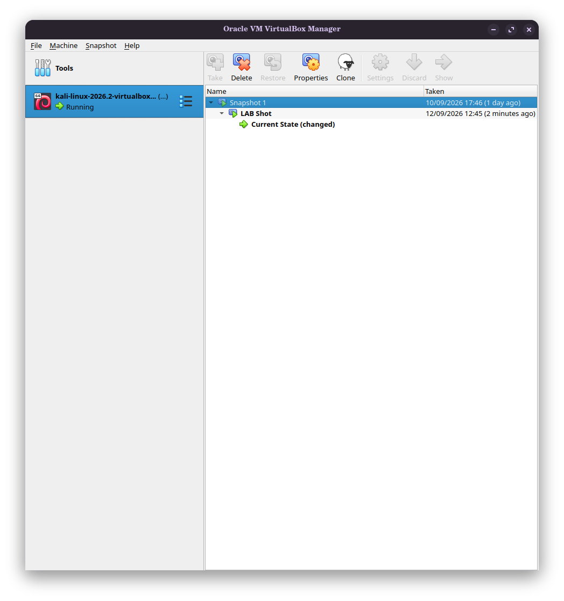

# NETWORKWALKS-KUDLON-B083-WK1-PM1-CYBERSECURITY-LAB-SETUP
# Cybersecurity Lab Environment Setup

Building an isolated virtual lab for penetration testing and ethical hacking practice.

## Project Overview
This project focuses on setting up a virtual cybersecurity and penetration-testing laboratory using VirtualBox and Kali Linux. The purpose of the lab is to create a controlled environment where cybersecurity tools and vulnerability assessments can be performed safely. The lab uses a private virtual NAT network so that vulnerable target machines can be added later.

## Environment Details
- **Hypervisor:** Oracle VirtualBox 7.x
- **Attacker Machine:** Kali Linux (Pre-built VirtualBox Image)
- **Virtual Network:** NAT Network
- **Subnet:** `10.0.0.0/24`
- **Kali Linux IP Address:** `10.0.0.2` (Static)
- **Host OS:** Zorin OS

## Implementation Steps
### 1. Host Preparation
- Installed VirtualBox and the VirtualBox Extension Pack on Zorin OS via the terminal.
- Added the host user to the `vboxusers` group to enable USB passthrough.
- Extracted the highly compressed `.7z` Kali Linux image using `p7zip`.

### 2. Network Configuration
- Created a dedicated **NAT Network** in VirtualBox using the `10.0.0.0/24` subnet with DHCP enabled for external routing.
- Imported the `.vbox` configuration and attached the network adapter to the NAT Network.

### 3. Virtual Machine Configuration
- Enabled **Bidirectional** Shared Clipboard and Drag'n'Drop.
- Mapped a shared folder (`/downloads`) from the Zorin OS host to the Kali VM with auto-mount enabled.

### 4. IP Configuration & Troubleshooting
- Set a static IPv4 address of `10.0.0.2` with a `10.0.0.1` gateway and `8.8.8.8` DNS.
- **Troubleshooting Note:** Encountered a VirtualBox black screen freeze caused by a USB filter conflict with a Wi-Fi adapter. Resolved by deleting the USB filter to allow the boot sequence to complete, logging in, and re-attaching the device.
- Successfully verified internet access and ran system updates.

### 5. Snapshot
- Created a base system snapshot ("Phase 1 Complete - Base Config") to preserve the clean, correctly networked state of the VM.

## Screenshots
*(Upload your screenshots here showing your static IP, ping test, and snapshot)*

